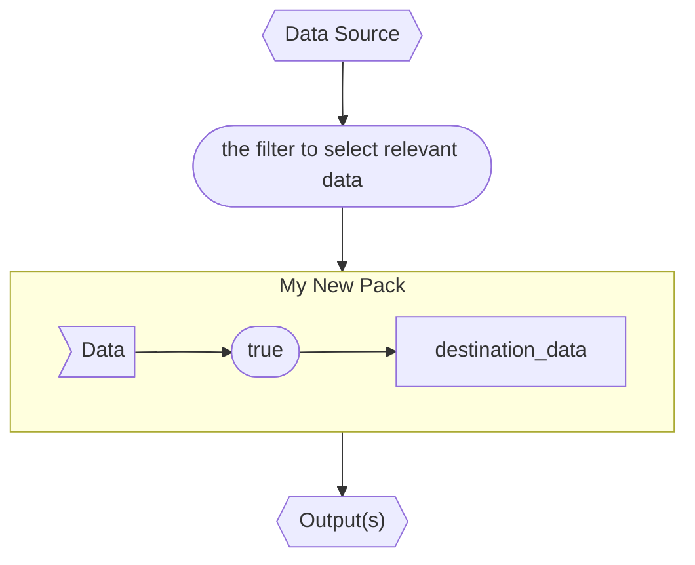

# My New Pack
A short description of my new pack

## Requirements
My new pack relies on some other things

## Release Notes
I have never released this pack before

## Data Flow diagram
It's possible to make a diagram in the markdown.  In more complex packs, I'll move this to a separate pipelines.md file.

## Contributing to the Pack
Pleae don't try to help with this.

## Contact
I can be reached via email@my.add.ress

## License
This pack is released under the Apache-2 license, see LICENSE for details.
